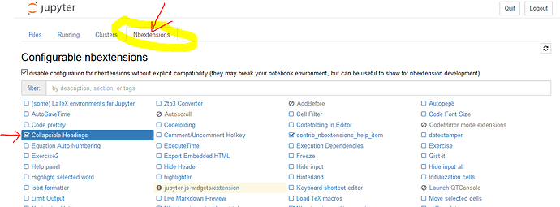

# containers-workshop
## Setup
`pipenv install`
`pipenv shell`
`jupyter notebook`

## Collapsible heading extension
`jupyter contrib nbextension install --user`
`jupyter nbextensions_configurator enable --user`

